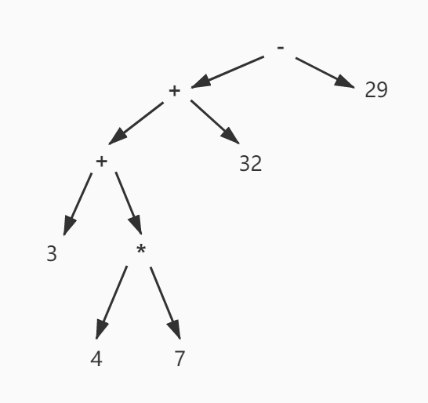

# 编译原理 - 第一部分 概论

# 第 1.2 节 - 编译过程

## 1.2.1 编译过程

现代编译器的编译过程一般按顺序为

1. 词法分析
2. 语法分析
3. 语义分析
4. (机器无关的)中间代码生成
5. (机器无关的)中间代码优化
6. 目标代码生成

我们接下来以“输入-输出”的方式来整体性地认识一下上述过程

## 1.2.2 词法分析

**词法分析**将具体的源程序初步抽象为若干词法单元的集合。它用某种规则顺序扫描输入串，根据词法规则，将串分隔为若干词法单元，并向**语法分析**过程输出。

    例1.1 
    表达式处理程序的词法分析的某输入和输出(这个输出被显式打印了出来，但是在标准的编译过程中，我们不会打印)：

    输入: "3+4*7+32-29"
    输出: 
        token type: 1   lexical info: 3
        token type: 43  lexical info: +
        token type: 1   lexical info: 4
        token type: 42  lexical info: *
        token type: 1   lexical info: 7
        token type: 43  lexical info: +
        token type: 1   lexical info: 32
        token type: 45  lexical info: -
        token type: 1   lexical info: 29

同时，这一个过程会收集词法单元的字面属性信息，比如上述例子中，它可以将串`32`标记为整形，并且将其附加在词法单元的属性值里，在上述例子中，以`token type`呈现。同时，对于标识符，它可以维护一个符号表来记载它们，并支持编译的后续步骤来访问、完善这个符号表。

但请注意，词法分析器的视野只限于一个单词中，所以如果源代码中有类似于`float temp;`的输入，词法分析器是无法将`temp`设置为浮点类型的。

与词法分析相关的内容将在第二章叙述。

## 1.2.3 语法分析

**语法分析**将词法分析产出的**词法单元**串按照特定的语法规则，将句子转化为树形结构，这种树形结构被称为这种语法规则下，这一条源程序的**语法树**。

在一般的语法分析中，语法分析器会调用词法分析器为其生成下一个词法单元。

一个良构的语法分析程序，对于同一输入，有且仅有一颗语法树。

    例1.2 
    表达式处理程序的语法分析的某输入和输出(这个输出被显式打印了出来，但是在标准的编译过程中，我们不会打印)：

    输入: "3+4*7+32-29"
    输出: 

一般的语法分析能够看到的内容只有目前的句子，这样的语法分析被称为**上下文无关语法分析**。所以C语言中存在着未经声明的变量一类的错误不会被语法分析发现。

与语法分析相关的内容将在第三章叙述。

## 1.2.4 语义分析

语义分析主要基于语法分析树和词法分析中得出的词法单元的属性值来计算各个词法单元的上下文相关属性值，比如值类型，并将其添加入符号表。

在这个过程中，程序也会基于上下文，对语法分析树的结构进行检查，比如函数调用中的参数个数、类型转换是否合法，调用的变量是否经过声明等。

在某些情况下，语义分析会对语法树进行调整，比如隐式类型转换。

与语义分析相关的内容将在第四章叙述。

## 1.2.5 中间代码生成

中间代码生成将语法树转化为某种形式的中间代码，通常为三地址码。这种中间代码通常是抽象的，与机器的底层实现无关的。

中间代码生成在本质上是对于语法树的遍历。